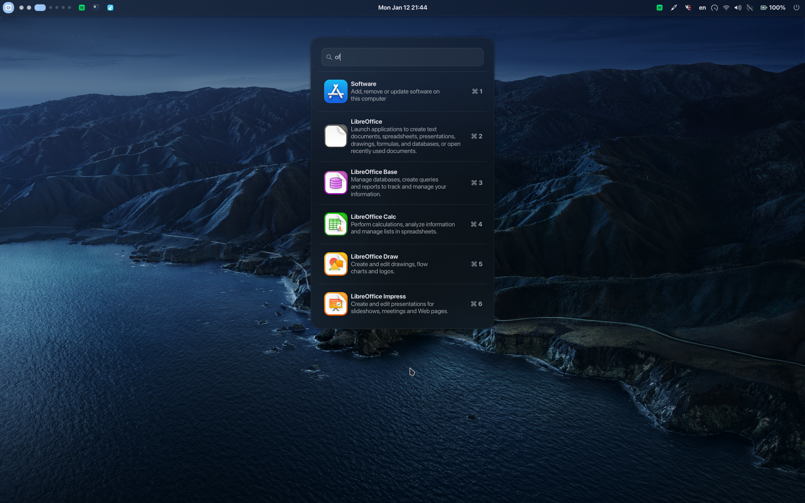

# NixOS Dotfiles

[](https://nixos.org)
[](https://github.com/nix-community/home-manager)
[](https://hyprland.org)
[](LICENSE)

A fully declarative NixOS configuration featuring Hyprland, AGS shell, and Home Manager. Modular host management and dynamic theming with matugen.



## Highlights

- **Hyprland** - Tiling Wayland compositor with animations and blur
- **AGS Shell** - GTK4 desktop shell with launcher, tray, workspace overview, notifications, and more
- **Fully Declarative** - Entire system reproducible from flake
- **Multi-Host** - Easy per-machine configuration (laptops, desktops)
- **Dynamic Theming** - Wallpaper-based colorschemes via matugen

---

## Quick Start

**Requirements:** NixOS unstable, repo at `~/.dotfiles`

```bash
cd ~
git clone --recurse-submodules https://github.com/TheWolfStreet/dotfiles.git .dotfiles
cd .dotfiles
```

**Configure once:**
```bash
nvim flake.nix  # set username, gitName, gitEmail
```

**On fresh installs:**
```bash
sudo nixos-generate-config --show-hardware-config \
  | sudo tee /etc/nixos/hardware-configuration.nix
```

**Create/edit host in `hosts/`:**
- copy template (see [hosts](#hosts))
- set gpu, cpu, monitors, keyboard, power
- register in `flake.nix`

**First build:**
```bash
sudo nixos-rebuild switch --flake .#<hostname> --impure
sudo reboot
```

**First login:**
- land in tty, login (password = username)
- `passwd` to change it
- `start-hyprland` to launch

---

## Daily Workflow

**Never type the long command again:**

```bash
nx-switch   # rebuild + switch
nx-boot     # apply on next boot
nx-test     # test without commitment
nx-update   # update inputs + rebuild
nx-gc       # garbage collect
```

**Typical edit:**
```bash
nvim ~/.dotfiles/home/packages.nix
nx-switch
```

---

## Hosts

Hosts define hardware, monitors, and machine-specific settings.

**Template:**
```nix
{ username, hostname, ... }: {
  imports = [
    ./common.nix
    /etc/nixos/hardware-configuration.nix
    ../modules/hardware/amd.nix
  ];

  networking.hostName = hostname;

  hardware = {
    enableAllFirmware = true;
    nvidia.enable = true;
    nvidia.persistence.enable = true;
    amd.cpu.enable = true;
  };

  power.enable = true;  # enable for laptops

  home-manager.users.${username} = {
    wayland.windowManager.hyprland.settings = {
      monitor = [ "eDP-1,1920x1080@60,0x0,1" ];
      input.kb_layout = "us";
    };
  };
}
```

---

## Structure

```
~/.dotfiles/
├── hosts/              # machine-specific configs
├── modules/
│   ├── system/         # base OS layer
│   ├── hardware/       # cpu/gpu tuning
│   └── desktop/        # compositor + desktop services
└── home/
    ├── packages.nix    # user packages
    ├── terminal/       # shell, prompt, tmux
    ├── desktop/        # hyprland, ags, browser, theme
    ├── dev/            # git, lf
    └── scripts/        # helpers
```

<details>
<summary><b>Detailed breakdown</b></summary>

### modules/system/
- `base.nix` - users, shells, home-manager
- `boot.nix` - bootloader, kernel params
- `hardware.nix` - bluetooth, firmware
- `locale.nix` - timezone, language
- `network.nix` - networking, firewall
- `power.nix` - suspend, power profiles
- `security.nix` - sudo, polkit
- `services.nix` - background daemons
- `virtualization.nix` - vms, containers
- `responsiveness.nix` - tuning

### modules/hardware/
- `amd.nix` - amd cpu/gpu, microcode
- `nvidia.nix` - nvidia driver, wayland

### modules/desktop/
- `audio.nix` - pipewire, low-latency
- `hyprland.nix` - compositor, portals, lockscreen
- `nautilus.nix` - file manager
- `plymouth.nix` - boot splash

### home/desktop/
- `hyprland.nix` - user config, keybinds
- `ags.nix` - ags2-shell dependencies
- `browser.nix` - browser policies
- `spotify.nix` - spicetify theming
- `dconf.nix` - gsettings
- `theme.nix` - gtk/icons/cursors
- `colors.nix` - shared colors

</details>

---

## Common Tasks

**Change settings:**
- username → `flake.nix`
- packages → `home/packages.nix`
- timezone/locale → `modules/system/locale.nix`
- keyboard/monitors → `hosts/<hostname>.nix`
- keybinds → `home/desktop/hyprland.nix`

**Find monitor names:**
```bash
hyprctl monitors
```

---

## Keybinds

<details>
<summary><b>Core navigation</b></summary>

| keybind                | action                   |
| ---------------------- | ------------------------ |
| super + 1..7           | workspace 1–7            |
| super + shift + 1..7   | move to workspace        |
| super + grave          | special workspace        |
| super + q              | close window             |
| super + f              | fullscreen               |
| super + space          | float/tile               |
| super + arrows         | move window              |
| super + shift + arrows | resize window            |
| alt + tab              | cycle windows            |
| super + left/right mouse | move/resize window     |

</details>

<details>
<summary><b>Launcher & apps</b></summary>

| keybind             | action            |
| ------------------- | ----------------- |
| super + r           | launcher          |
| super + tab         | overview          |
| super + x           | terminal          |
| super + b           | browser           |
| super + e           | file manager      |
| super + l           | lock              |
| ctrl + alt + delete | restart ags shell |

</details>

<details>
<summary><b>Media & hardware</b></summary>

| keybind                   | action              |
| ------------------------- | ------------------- |
| print                     | screenshot (area)   |
| shift + print             | screenshot (full)   |
| super + print             | record area         |
| super + shift + print     | record screen       |
| xf86audio play/pause/next | media controls      |
| xf86audio mute            | toggle mute         |
| shift + xf86audiomute     | toggle mic          |
| xf86monbrightness up/down | brightness          |
| xf86touchpadtoggle        | toggle touchpad     |

</details>

---

## Notes

- no display manager (tty → hyprland)
- flakes required
- first rebuild needs `--impure`, rest are routine

---

## License

MIT. Provided as-is.
