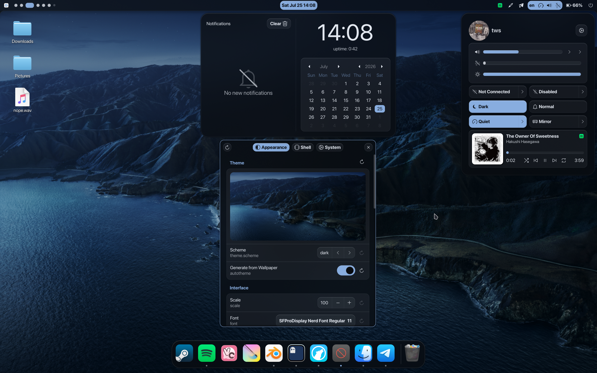

# NixOS Dotfiles

[](https://nixos.org)
[](https://github.com/nix-community/home-manager)
[](https://hyprland.org)
[](LICENSE)

A multi-host NixOS and Home Manager configuration built around Hyprland and the [ags2-shell](https://github.com/TheWolfStreet/ags2-shell) desktop shell. Hardware support, user identity, laptop power management, virtualization, and specialized packages are selected per host.



## Included

- Hyprland desktop with tuigreet, Hyprlock, GTK/Qt theming, and GNOME desktop services
- Packaged AGS v3/Astal shell with launcher, overview, dock, desktop icons, notifications, quick settings, and wallpaper theming
- PipeWire and WirePlumber with a fixed 44.1 kHz rate and 512-sample quantum
- NetworkManager, key-only SSH defaults, Flatpak, and declarative Flathub provisioning
- AMD, Intel, and NVIDIA hardware modules with native and 32-bit graphics acceleration
- Optional gaming, laptop power management, Docker, Podman, libvirt, SPICE USB redirection, and VM tooling
- Home Manager configuration for terminal tools, Neovim, browsers, media applications, development tools, and system utilities
- Optional security, reversing, forensics, wireless, and RF tooling through `home/pentest.nix`

## Quick Start

### 1. Clone The Repository

The AGS shell is a Git submodule, so clone recursively into the path expected by the rebuild helpers:

```bash
git clone --recurse-submodules https://github.com/TheWolfStreet/dotfiles.git ~/.dotfiles
cd ~/.dotfiles
```

For an existing non-recursive clone:

```bash
git submodule update --init --recursive
```

### 2. Configure Identity And Hosts

Edit the shared values and host registry in `flake.nix`:

```nix
let
  defaultUsername = "user";
  gitName = "Your Name";
  gitEmail = "you@example.com";

  hosts = {
    laptop = {};
    desktop = {
      username = "another-user";
      hostname = "workstation";
    };
  };
in
# ...
```

Each attribute name is a flake configuration and selects `hosts/<configuration>.nix`. The username defaults to `defaultUsername`; the hostname defaults to the configuration name. Overrides affect the user account, Home Manager path, hostname, and generated rebuild commands together.

### 3. Define The Host

Create `hosts/<configuration>.nix` and import the shared modules plus the machine-generated hardware configuration:

```nix
{
  username,
  ...
}: {
  imports = [
    ./common.nix
    /etc/nixos/hardware-configuration.nix
  ];

  hardware.amd = {
    cpu.enable = true;
    gpu.enable = true;
  };

  gaming.enable = true;
  power.enable = true;
  virtualisation.enable = true;

  home-manager.users.${username}.wayland.windowManager.hyprland.settings = {
    monitor = ["eDP-1,1920x1080@60,0x0,1"];
    input.kb_layout = "us";
  };
}
```

Keep `/etc/nixos/hardware-configuration.nix` outside this repository. Its absolute import is why rebuild commands use `--impure`.

### 4. Build And Boot

```bash
sudo nixos-rebuild boot --flake ~/.dotfiles#<configuration> --impure
sudo reboot
```

Tuigreet starts after boot. The bootstrap password is the configured username; replace it immediately after the first login:

```bash
passwd
```

## Host Options

Hosts compose the common desktop, hardware, and system modules and enable only machine-specific behavior.

| Option | Purpose |
| --- | --- |
| `hardware.amd.cpu.enable` | AMD microcode, `amd_pstate`, and Zenpower |
| `hardware.amd.gpu.enable` | AMDGPU and Mesa graphics support |
| `hardware.amd.gpu.rocm.enable` | ROCm support; defaults to the AMD GPU setting |
| `hardware.amd.gpu.disablePanelSelfRefresh` | Opt-in suspend/resume workaround for affected laptop panels |
| `hardware.intel.cpu.enable` | Intel microcode |
| `hardware.intel.gpu.enable` | Intel graphics and VA-API support |
| `hardware.intel.gpu.vaapiDriver` | `modern` for Broadwell and newer, `legacy` for older GPUs |
| `hardware.nvidia.enable` | NVIDIA driver, Wayland, and video acceleration |
| `hardware.nvidia.persistence.enable` | NVIDIA persistence daemon |
| `gaming.enable` | Steam, Gamescope, Gamemode, and local-transfer firewall support |
| `power.enable` | Laptop power, lid, suspend, and device power policies |
| `virtualisation.enable` | Docker, Podman, libvirt, virt-manager, Boxes, Distrobox, Lazydocker, SPICE USB, and `nx-vm` |

Hardware-specific NixOS options can be added directly in a host. Examples in this repository include ASUS services, Intel legacy VA-API, RF hardware, Wireshark USB capture, and host-specific NetworkManager or WirePlumber rules.

Import `../home/pentest.nix` into a host's Home Manager configuration only where the security toolkit is wanted:

```nix
home-manager.users.${username}.imports = [../home/pentest.nix];
```

## Daily Workflow

The installed helpers retain the current flake configuration name even when it differs from the machine hostname.

| Command | Action |
| --- | --- |
| `nx-switch` | Build and switch immediately |
| `nx-boot` | Build and select the generation for the next boot |
| `nx-test` | Activate temporarily without adding a boot entry |
| `nx-update` | Update flake inputs and switch |
| `nx-gc` | Expire old Home Manager generations, collect old Nix generations, and optimize the store |
| `nx-vm` | Build and run the host VM; installed only when virtualization is enabled |
| `hyprlock-revive` | Restore and relaunch Hyprlock after a lock failure |

A typical change is:

```bash
nvim ~/.dotfiles/home/packages.nix
nx-switch
```

Useful direct checks:

```bash
nix flake check --impure
hyprctl monitors
journalctl --user -u ags.service -b
```

## AGS Shell

The root flake builds `ags2-shell` from the submodule and installs the matching AGS CLI. Home Manager runs the packaged shell as `ags.service`; the source checkout is not needed at runtime. The desktop configuration also installs the GTK portal backend so Flatpak and portal clients receive the shell's light or dark preference.

Use the submodule development environment for shell changes:

```bash
cd ~/.dotfiles/ags2-shell
systemctl --user stop ags.service
nix develop -c ./dev.sh
systemctl --user start ags.service
```

The development process and packaged service use the same `ags2-shell` instance name and must not run together. Build and usage details, including native installation on other Linux distributions, are documented in the [ags2-shell repository](https://github.com/TheWolfStreet/ags2-shell).

## Repository Layout

```text
~/.dotfiles/
|-- ags2-shell/       # Standalone AGS shell submodule
|-- hosts/            # Machine-specific hardware and desktop settings
|-- modules/
|   |-- desktop/      # Hyprland, audio, greeter, Chromium policy, gaming, and desktop services
|   |-- hardware/     # Devices plus AMD, Intel, and NVIDIA options
|   `-- system/       # Base OS, boot, network, power, services, and virtualization
|-- home/
|   |-- desktop/      # AGS service, Hyprland bindings, themes, browser, and Spotify
|   |-- terminal/     # Shell, Ghostty, tmux, mail, GPG, and prompt
|   |-- nvim/         # Neovim package and configuration
|   |-- dev/          # Git and development tools
|   |-- easyeffects/  # EasyEffects configuration and presets
|   |-- scripts/      # Rebuild, lock recovery, and touchpad helpers
|   |-- packages.nix  # Shared user applications and utilities
|   `-- pentest.nix   # Optional security toolkit
|-- flake.nix         # Inputs, identities, host registry, and system constructor
`-- flake.lock
```

## Keybindings

### Navigation And Applications

| Binding | Action |
| --- | --- |
| `Super + 1..7` | Select workspace |
| `Super + Shift + 1..7` | Move window to workspace |
| `Super + grave` | Select special workspace |
| `Super + Q` | Close window |
| `Super + F` | Toggle fullscreen |
| `Super + Space` | Toggle floating |
| `Super + arrows` | Move window |
| `Super + Shift + arrows` | Resize window |
| `Alt + Tab` | Cycle windows |
| `Super + R` | Open launcher |
| `Super + Tab` | Open workspace overview |
| `Super + X` | Open terminal |
| `Super + B` | Open browser |
| `Super + E` | Open file manager |
| `Super + L` | Lock session |
| `Ctrl + Alt + Delete` | Restart AGS shell |

### Capture And Hardware

| Binding | Action |
| --- | --- |
| `Print` | Select screenshot area |
| `Shift + Print` | Capture focused monitor |
| `Super + Print` | Select recording area |
| `Super + Shift + Print` | Record focused monitor |
| `XF86Audio*` | Media and volume controls |
| `Shift + XF86AudioMute` | Toggle microphone mute |
| `XF86MonBrightness*` | Change display brightness |
| `XF86TouchpadToggle` | Toggle touchpad |

## Operational Notes

- This configuration tracks unstable inputs and is currently constructed for `x86_64-linux`.
- `/etc/nixos/hardware-configuration.nix` remains machine-local, so evaluation and rebuild commands require `--impure`.
- SSH permits public-key authentication by default, denies root login, and disables password authentication unless a host explicitly overrides it.
- Flatpak is enabled system-wide and Flathub provisioning retries until networking becomes available.
- Home Manager conflict backups use the `.hm-bak` extension and are ignored by Git.

## License

MIT. Provided as-is.
