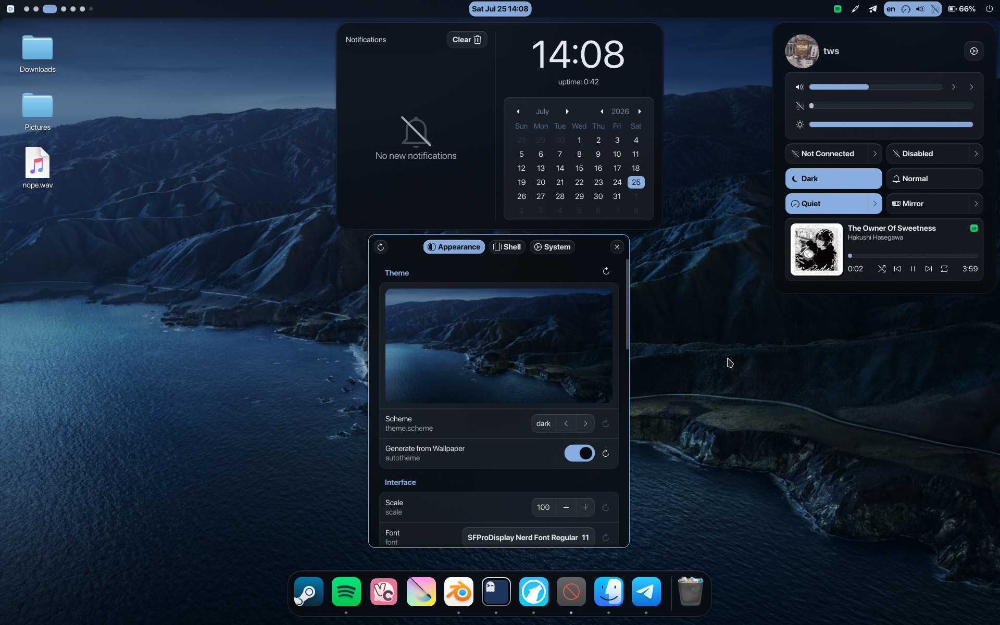

# NixOS Dotfiles

[](https://nixos.org)
[](https://github.com/nix-community/home-manager)
[](https://hyprland.org)
[](LICENSE)

A multi-host NixOS and Home Manager configuration built around Hyprland and the [ags2-shell](https://github.com/TheWolfStreet/ags2-shell) desktop shell. Hardware support, user identity, laptop power management, virtualization, and specialized packages are selected per host.



## Included

- Hyprland desktop with tuigreet, Hyprlock, GTK/Qt theming, GNOME services, and the packaged AGS shell
- PipeWire and WirePlumber fixed at 44.1 kHz with a 512-sample quantum, plus writable EasyEffects presets and MIDI hotplug bridging
- NetworkManager, key-only SSH defaults, Flatpak, and declarative Flathub provisioning
- AMD, Intel, and NVIDIA hardware modules with native and 32-bit graphics acceleration
- Optional gaming, laptop power management, containers, libvirt/VM tooling, and Hermes Agent integration
- Home Manager configuration for terminal tools, Neovim, browsers, media and creation applications, development tools, and system utilities
- FL Studio/Bottles integration and optional security, forensics, wireless, and RF tooling

## Current Hosts

| Selector | Machine | Notable configuration |
| --- | --- | --- |
| `ironmaiden` | Lenovo ThinkPad T420, user `ghost` | Legacy Intel VA-API, laptop power, RF/security tooling, no virtualization |
| `nixos` | AMD/NVIDIA desktop, user `tws` | Gaming, virtualization, NVIDIA persistence, host-specific audio and network rules |
| `nixtop` | ASUS TUF Gaming A16, user `tws` | AMD graphics, laptop power, gaming, virtualization, ASUS services, Hermes Agent |

All bundled host files contain machine-specific hardware, monitor, network, or service assumptions. New machines should get a new host selector rather than reusing one of these unchanged.

## Quick Start

### 1. Clone The Repository

The AGS shell is a Git submodule. Clone recursively to `~/.dotfiles`; generated rebuild helpers use that exact path under the configured user's home directory.

```bash
git clone --recurse-submodules https://github.com/TheWolfStreet/dotfiles.git ~/.dotfiles
cd ~/.dotfiles
```

For an existing non-recursive clone:

```bash
git submodule update --init --recursive
```

### 2. Configure Identity And Hosts

Edit the shared identity values and host registry in `flake.nix`. This example shows how to replace or add selectors; it is not the repository's current host list:

```nix
let
  defaultUsername = "user";
  gitName = "Your Name";
  gitEmail = "you@example.com";

  hosts = {
    laptop = {};
    desktop = {
      username = "another-user";
      hostname = "workstation";
    };
  };
in
# ...
```

Each attribute name is a flake configuration and selects `hosts/<configuration>.nix`. The username defaults to `defaultUsername`; the hostname defaults to the configuration name. Overrides affect the user account, Home Manager path, hostname, and generated rebuild commands together.

### 3. Define The Host

Create `hosts/<configuration>.nix` and import the shared modules plus the machine-generated hardware configuration:

```nix
{
  username,
  ...
}: {
  imports = [
    ./common.nix
    /etc/nixos/hardware-configuration.nix
  ];

  hardware.amd = {
    cpu.enable = true;
    gpu.enable = true;
  };

  gaming.enable = true;
  power.enable = true;
  virtualisation.enable = true;

  home-manager.users.${username}.wayland.windowManager.hyprland.settings = {
    monitor = ["eDP-1,1920x1080@60,0x0,1"];
    input.kb_layout = "us";
  };
}
```

Keep `/etc/nixos/hardware-configuration.nix` outside this repository. Its absolute import is why rebuild commands use `--impure`.

### 4. Build And Boot

```bash
sudo nixos-rebuild boot --flake ~/.dotfiles#<configuration> --impure
sudo reboot
```

Tuigreet starts after boot. On a fresh installation, the initial password is the configured username (`tws`, or `ghost` for `ironmaiden`). Change it after the first login:

```bash
passwd
```

Existing installations retain their passwords; rebuilds do not reset a changed password to the initial value. Desktop SSH intentionally accepts passwords, so change the bootstrap password before exposing it to an untrusted network.

## Host Options

Hosts compose the common desktop, hardware, and system modules and enable only machine-specific behavior.

| Option | Purpose |
| --- | --- |
| `hardware.amd.cpu.enable` | AMD microcode, `amd_pstate`, and Zenpower |
| `hardware.amd.gpu.enable` | AMDGPU and Mesa graphics support |
| `hardware.amd.gpu.rocm.enable` | ROCm support; defaults to the AMD GPU setting |
| `hardware.amd.gpu.disablePanelSelfRefresh` | Opt-in suspend/resume workaround for affected laptop panels |
| `hardware.intel.cpu.enable` | Intel microcode |
| `hardware.intel.gpu.enable` | Intel graphics and VA-API support |
| `hardware.intel.gpu.vaapiDriver` | `modern` for Broadwell and newer, `legacy` for older GPUs |
| `hardware.nvidia.enable` | NVIDIA driver, Wayland, and video acceleration |
| `hardware.nvidia.persistence.enable` | NVIDIA persistence daemon |
| `gaming.enable` | Steam, Gamescope, Gamemode, and local-transfer firewall support |
| `power.enable` | Laptop power, lid, suspend, and device power policies |
| `virtualisation.enable` | Docker, Podman, libvirt, virt-manager, Boxes, Distrobox, Lazydocker, SPICE USB, and `nx-vm` |
| `hermes.enable` | Hermes Agent; available when the host explicitly imports the Hermes feature module |

Hardware-specific NixOS options can be added directly in a host. Examples include ASUS services, Intel legacy VA-API, RF hardware, Wireshark USB capture, and host-specific NetworkManager or WirePlumber rules. The optional Hermes implementation path is another impure, machine-local input.

For generic Hermes support, add `(import ../modules/system/hermes.nix {})` to the host's imports and set `hermes.enable = true`. The module also accepts an `implementation` module path. `hosts/nixtop.nix` explicitly selects `~/.hermes/nixos/hermes.nix` when present and otherwise uses the generic package; other hosts do not discover or import this local code.

Import `../home/pentest.nix` into a host's Home Manager configuration only where the security toolkit is wanted:

```nix
home-manager.users.${username}.imports = [../home/pentest.nix];
```

## Daily Workflow

The installed helpers retain the current flake configuration name even when it differs from the machine hostname.

| Command | Action |
| --- | --- |
| `nx-switch` | Build and switch immediately |
| `nx-boot` | Build and select the generation for the next boot |
| `nx-test` | Activate temporarily without adding a boot entry |
| `nx-update` | Update inputs and switch; report the failed phase without discarding lockfile changes |
| `nx-gc` | List available generations and confirm before expiring/collecting them; `--yes` skips confirmation |
| `nx-vm` | Build and run the host VM; installed only when virtualization is enabled |
| `hyprlock-revive` | Restore and relaunch Hyprlock after a lock failure |

A typical change is:

```bash
nvim ~/.dotfiles/home/packages.nix
nx-switch
```

Useful direct checks:

```bash
nix fmt -- flake.nix hosts modules home
nix flake check --impure --no-update-lock-file
nix build --impure --no-update-lock-file --no-link .#nixosConfigurations.nixtop.config.system.build.toplevel
hyprctl monitors
journalctl --user -u ags.service -b
```

Use the matching selector on each physical machine. Hardware remains deliberately external: evaluating another selector here combines its policy with this machine's `/etc/nixos/hardware-configuration.nix`, not that host's actual hardware. Flake checks build the root Nix formatting check and AGS package; they do not replace a system build or boot/audio/suspend tests. Formatting commands above exclude the independently maintained shell submodule. Add `--offline` to checks and builds when all required sources and dependencies are already cached.

`nx-gc` is intentionally destructive to rollback history; do not run it while testing a new generation. It expires standalone Home Manager generations older than one day, deletes all old root-profile Nix generations, and optimizes the store. In NixOS-managed homes without a standalone Home Manager profile, only the system generation collection applies. Cancelling the prompt deletes nothing.

VM variants use the username as a disposable test password, disable SSH and physical ASUS/Hermes integration, and do not change the production account's password.

### Terminal And Files

Each Ghostty terminal starts a fresh, independent tmux session. Use the session chooser to switch to existing work, or `tmux attach-session -t <name>` from outside tmux to reattach to a detached session.

The tmux prefix is `Ctrl+Space`; press it before the second key:

| Binding | Action |
| --- | --- |
| Prefix, `c` | New window in the current directory |
| Prefix, `"` / `%` | Split vertically/horizontally in the current directory |
| Prefix, `h/j/k/l` | Select pane |
| Prefix, `d` | Detach; use the session chooser or `attach-session` to return |
| Prefix, `s` / `w` | Choose session/window |
| Prefix, `,` / `$` | Rename window/session |
| Prefix, `v`, then `v` and `y` | Enter copy mode, select, copy |
| Prefix, `?` | Show tmux bindings |
| `Alt+1..0` | Select window by its current number |

Raw `Ctrl+h/j/k/l` remain available to the shell, LF, and NeoMutt. Neovim uses these keys for normal-mode window/tmux navigation, not insert-mode editing. Nushell `q`, `:q`, and `exit` preserve history; `purge-history` explicitly removes failed-command history.

LF keeps `V` for visual selection and uses `i` for the current file's `bat` pager. `x` and Delete send selected files to the trash. All-text selections open together in Neovim; selections containing non-text files open with the configured opener. The LF package has a small selection-export patch so trash/open/zip preserve filenames containing spaces, tabs, quotes, wildcards, and newlines rather than guessing from newline-separated paths.

### Neovim

LazyVim's built-in extras load before custom overrides. Snacks is the general file/search/explorer interface; Telescope remains for specialized integrations. Nix provides Nix/Lua and C/C++/CMake tools; other enabled languages can use their project environments without enabling Mason on NixOS.

`<leader>` is Space:

| Binding | Action |
| --- | --- |
| `<leader>ff` / `fF` | Find files in project root / working directory |
| `<leader>fc` / `fg` | Config files / Git files |
| `<leader>sg` / `sG` / `sb` | Project grep / working-directory grep / buffer lines |
| `<leader>e` / `E` | Project / working-directory explorer |
| `<leader>,`, `H/L`, `<leader>bd` | Pick buffer, previous/next buffer, delete without disturbing splits |
| `gd`, `gr`, `K`, `<leader>cr`, `<leader>ca` | Definition, references, documentation, rename, code action |
| `<leader>xx` / `xX` | All available / current-buffer diagnostics |
| `<leader>cf`, `<leader>uf` / `uF` | Format; toggle global / buffer autoformat |
| `Ctrl+x`, `Ctrl+o` | Show completion; tmux owns `Ctrl+Space` |
| `<leader>p` in visual mode | Replace selection without changing the paste register |
| `<leader>cn`, `<leader>uP`, `<leader>ut` | Generate annotations, pick color, toggle transparency |
| `<leader>sk` / `sh` | Search bindings / help |

Normal `Ctrl+A` and visual `V` retain Vim semantics. The statusline always shows the relative file path, and its diff counters use Gitsigns. `:HexToggle` is explicit rather than automatic binary conversion. Git blame is on demand through existing Gitsigns bindings or `:GitBlameToggle`.

For project-specific compiler/tool versions, enter `nix develop` inside a tmux pane before starting Neovim. Reattaching an existing session does not import a new environment. C/C++ projects should supply `compile_commands.json` through their CMake presets or build configuration; formatter/editorconfig rules own indentation. Use `:ConformInfo`, `:LazyFormatInfo`, and the LSP configuration picker to diagnose missing tools. Nixd evaluates option completion for this checkout's configured host, not an unrelated project's system.

### Recovery

The boot menu timeout remains zero. Hold or repeatedly press Space during startup to reach systemd-boot and select an older generation.

From an authenticated TTY or SSH connection, use `hyprctl instances` to identify the compositor, then `hyprlock-revive <instance>` to request lock restoration. Inside the graphical session, the helper uses its current instance automatically. A successful dispatch is not proof that the lock rendered: verify it on the display. If the compositor is unavailable, inspect its logs or end the affected session instead of repeatedly launching lock clients.

Lid/dock automation runs in the Hyprland session; pre-login logind lid behavior is unchanged. Panel recovery preserves saved display state while a readable lid reports closed, and monitor-query failures do not count as an undocked state. The lock screen shows the layout and Caps Lock feedback for password entry.

## AGS Shell

The root flake builds `ags2-shell` from the submodule, installs the matching AGS CLI, and runs the packaged shell as `ags.service`. The GTK portal backend provides portal settings such as the desktop color-scheme preference. Development, controls, packaging, and native installation are documented in the [submodule README](ags2-shell/README.md).

## Managed User Configuration

- EasyEffects is enabled on every host. Home Manager links `~/.config/easyeffects` and `~/.local/share/easyeffects` to writable checkout directories under `home/easyeffects/`; device-specific autoload filenames may need adjustment on another machine. GUI edits change the checkout, and Nix generation rollback does not restore these files. Preserve live state and `.hm-bak` backups before changing ownership or link targets.
- `home/music.nix` runs a MIDI hotplug bridge that connects hardware sequencer ports to `Midi Through:0`. The FL Studio Hyprland watcher is also installed globally; Bottles setup and restart requirements are documented in [docs/fl-studio-bottles.md](docs/fl-studio-bottles.md).
- Nix manages Neovim and its Lua configuration; Lazy manages downloaded plugins and its lockfile in the user cache. Plugin versions are not frozen by a Nix generation, and clearing the cache can discard that lockfile.
- Hyprland-specific MIME defaults select LibreWolf for web links and HTML without replacing the writable `~/.config/mimeapps.list` or its other application associations.

## Repository Layout

```text
~/.dotfiles/
|-- ags2-shell/       # Standalone AGS shell submodule
|-- docs/             # Specialized operational guides
|-- hosts/            # Machine-specific hardware and desktop settings
|-- modules/
|   |-- desktop/      # Hyprland, audio, greeter, Chromium policy, gaming, and desktop services
|   |-- hardware/     # Devices plus AMD, Intel, and NVIDIA options
|   `-- system/       # Base OS, Home Manager bridge, boot, network, power, and services
|-- home/
|   |-- desktop/      # AGS, Hyprland, themes, applications, and FL Studio integration
|   |-- terminal/     # Shell, Ghostty, tmux, mail, GPG, and prompt
|   |-- nvim/         # Neovim package and configuration
|   |-- dev/          # Git and development tools
|   |-- easyeffects/  # EasyEffects configuration and presets
|   |-- scripts/      # Rebuild, lock recovery, and touchpad helpers
|   |-- music.nix     # MIDI hotplug bridge
|   |-- packages.nix  # Shared user applications and utilities
|   `-- pentest.nix   # Optional security toolkit
|-- flake.nix         # Inputs, identities, host registry, and system constructor
`-- flake.lock
```

`modules/system/home-manager.nix` is the common Home Manager composition point. Application modules own configuration and required tools; `home/packages.nix` owns shared unconfigured applications. Hosts add their own settings and optional modules through normal NixOS/Home Manager merges.

## Common Keybindings

### Navigation And Applications

| Binding | Action |
| --- | --- |
| `Super + 1..7` | Select workspace |
| `Super + Shift + 1..7` | Move window to workspace |
| `Super + grave` | Select special workspace |
| `Super + Shift + grave` | Move window to special workspace |
| `Super + Q` | Close window |
| `Super + F` | Toggle fullscreen |
| `Super + Space` | Toggle floating |
| `Super + P` | Toggle the dwindle split direction |
| `Super + arrows` | Move window |
| `Super + Shift + arrows` | Resize window |
| `Super + Ctrl + arrows` | Focus window in direction |
| `Alt + Tab` | Cycle windows |
| `Ctrl + Alt + Tab` | Cycle windows backward without triggering the Alt+Shift layout toggle |
| `Alt + Shift` | Cycle configured keyboard layouts |
| `Super + R` | Open launcher |
| `Super + Tab` | Open workspace overview |
| `Super + X` | Open terminal |
| `Super + B` | Open browser |
| `Super + E` | Open file manager |
| `Super + L` | Lock session |
| `Ctrl + Alt + Delete` | Restart AGS shell |
| `Super + mouse left/right` | Move or resize a window |

### Capture And Hardware

| Binding | Action |
| --- | --- |
| `Print` | Select screenshot area |
| `Shift + Print` | Capture focused monitor |
| `Super + Print` | Select recording area |
| `Super + Shift + Print` | Record focused monitor |
| `XF86PowerOff` | Open shutdown confirmation |
| `XF86Audio*` | Media and volume controls |
| `Shift + XF86AudioMute` | Toggle microphone mute |
| `XF86MonBrightness*` | Change display brightness |
| `Ctrl + F7/F8` | Decrease/increase display brightness |
| `XF86KbdBrightness*` | Change the single standard keyboard backlight by one step; unsupported hardware is a no-op |
| `XF86TouchpadToggle` | Toggle touchpad |
| `mouse:276` | Momentary microphone unmute; release mutes, including during lock |

Keyboard-backlight controls detect LED devices ending in `:kbd_backlight` at runtime, independently of ASUS services. Multiple matching devices produce an explicit error instead of choosing arbitrarily; use `brightnessctl --class=leds --device=<name>` to select one explicitly. ThinkLight and zoned RGB controls are separate interfaces. Permission and write failures remain visible.

## Operational Notes

- This configuration tracks unstable inputs and is currently constructed for `x86_64-linux`.
- `/etc/nixos/hardware-configuration.nix` remains machine-local, and enabled Hermes configurations may import `~/.hermes/nixos/hermes.nix`; evaluation and rebuild commands therefore use `--impure`.
- SSH denies root login. The `nixos` desktop intentionally accepts passwords and public keys; the other physical hosts default to public-key authentication only.
- Flatpak is enabled system-wide and Flathub provisioning retries until networking becomes available.
- Home Manager conflict backups use the `.hm-bak` extension and are ignored by Git.

## License

MIT. Provided as-is.
